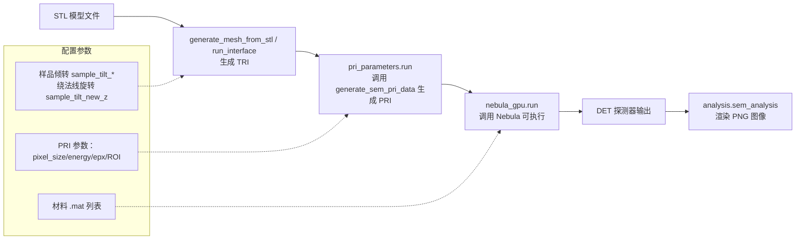

# Nebula Python Wrapper 项目文档

## 项目概述

Nebula Python Wrapper 是一组用于运行与分析 Nebula 仿真的 Python 工具与脚本，涵盖几何（TRI）生成、电子束输入（PRI）生成、Nebula 可执行调用与结果可视化，同时提供“图像转视频”的桌面 GUI 便捷工具。

适用对象与前置条件：
- 适用对象：从事实验/仿真/软件工程的研究人员与工程师
- 环境前置：Python 3.9+；Linux 桌面环境（GUI 部分需要）；已具备 Nebula 可执行（`source/nebula_gpu`）与材料 `.mat` 文件

端到端流程（概览）：
1) STL → TRI：`voxel_to_mesh.generate_mesh_from_stl`/`run_interface`（倾转与绕法线旋转）
2) ROI/能量等 → PRI：`sem_pri.generate_sem_pri_data`（`pri_parameters.run` 包装）
3) TRI + PRI + MAT → DET：`run_nebula.nebula_gpu.run()` 调用可执行并监控进度
4) DET → PNG：`analysis.sem_analysis` 输出图像（GUI/自动脚本均可复用）

简明流程图（Mermaid）：



## 项目结构（当前）

```
nebula_python_wrapper/
├── CHANGELOG.md
├── PROJECT_DOCUMENTATION.md      # 本文件
├── README.md
├── TECHNICAL_DOCUMENTATION.md
├── USER_GUIDE.md
├── troubleshooting.md
├── docs/
│   └── nebula_gpu_python_wrapper_doc.md
├── requirements.txt              # 运行依赖（含 PyQt6、opencv-python）
├── setup.py
├── LICENSE
├── Makefile                      # 常用任务（install/format/lint/gui/sem/sim）
├── pyproject.toml                # 代码风格与检查配置（black/isort/ruff）
├── requirements-dev.txt          # 开发依赖（ruff/black/isort）
└── source/
   ├── __init__.py
   ├── analysis.py               # 提供 sem_analysis 等分析函数
   ├── auto_run_simulation.py    # 批量自动仿真主脚本
   ├── generate_circular_mesh.py
   ├── generate_cylinder_mesh.py
   ├── generate_tri_pri.py
   ├── images_to_video_gui.py    # 图像转视频 GUI（PyQt6 + OpenCV）
   ├── nebula_gpu                # Nebula 可执行文件（Linux 示例）
   ├── nebula_gui.py             # 交互式 GUI（仿真相关）
   ├── parameters.py             # tri_parameters / pri_parameters
   ├── process_stl_to_tri.py
   ├── read_stl_to_txt.py
   ├── rotate_cylinder.py
   ├── rotation_matrix.py
   ├── run_nebula.py             # nebula_gpu 调用与进度监控封装
   ├── save_parameters.py
   ├── sem-analysis.py           # SEM 分析脚本（示例）
   ├── sem_pri.py                # 电子束输入 (.pri) 生成
   ├── tri_view_gui.py
   └── voxel_to_mesh.py          # STL/体素到 TRI 生成
```

## 核心功能

### 1. SEM 图像模拟

项目提供了一套完整的工具链，用于模拟扫描电子显微镜(SEM)图像：

- **电子束数据生成**：`sem_pri.py` 脚本生成包含电子束数据的 `.pri` 文件，模拟电子在样品表面的行为。
- **网格生成与处理**：提供了多种工具来生成和处理三角形网格，包括从 STL 文件转换、旋转和变换网格等。
- **探测器模拟**：模拟电子与样品相互作用后被探测器捕获的过程，生成 `.det` 文件。

### 2. 几何处理（TRI）与探测器/环境几何

- STL 与体素：
   - `voxel_to_mesh.py` 提供 `generate_mesh_from_stl` 与 `run_interface`，将 STL/体素转换为 TRI；
   - 内部会进行：尺度归一化 → 倾转/绕法线旋转 → 探测器多边形（36 边近似圆）与环境封闭面构造 → 输出 TRI。
- 编码约定（节选）：
   - 样品三角形：`0 -123 ...`
   - 探测器三角形：`-125 -125 ...`
   - 环境封闭面：`-122 -122`（墙）、`-127 -127`（底面）
- 其他工具：
   - `process_stl_to_tri.py` / `read_stl_to_txt.py`：STL 解析与转换
   - `generate_circular_mesh.py` / `generate_cylinder_mesh.py`：基础几何生成
   - `rotate_cylinder.py`：绕轴旋转

材料文件（`.mat`）说明：
- `auto_run_simulation.py` 中通过 `mat_paths_list=[Path('/path/to/silicon.mat'), ...]` 进行配置
- 多材料以空格拼接传给可执行：`... tri.pri silicon.mat pmma.mat > output.det`
- 请确保路径真实存在且文件格式满足 Nebula 要求

### 3. 图形用户界面

`nebula_gui.py` 提供了一个基于 PyQt6 的图形用户界面，使用户能够：

- 配置 Nebula GPU 参数
- 生成和处理 TRI 和 PRI 文件
- 可视化模拟结果
- 调整样品和探测器的倾转角度

此外，`images_to_video_gui.py` 提供图像转视频 GUI：
- 选择/追加多张图片（可跨文件夹），按名称或日期排序；
- 设置帧率、分辨率（含自定义）、宽高比策略（保持/拉伸）、质量（高/标准/压缩）；
- 编码器回退：优先尝试 HEVC/H.265（hev1）、H.264（avc1），不可用时回退到 mp4v；
- 自动将目标尺寸修正为偶数，提高编码兼容性。

性能与已知限制：
- 高分辨率或超长序列导出视频可能耗时较长；建议在 GUI 中选择“标准/压缩”质量或降低分辨率
- OpenCV 的 HEVC/H.264 支持依赖于编译选项；若不可用将回退到 `mp4v`（通常最兼容）

## 技术细节

### 电子束模拟（PRI 生成）

`sem_pri.py` 中的 `generate_sem_pri_data` 函数是电子束模拟的核心，它：

1. 生成一个包含电子位置、方向、能量和像素信息的数据结构
2. 支持泊松分布的电子数量，模拟真实电子束的散粒噪声
3. 支持高斯分布的光束斑点大小
4. 优化了内存使用，通过分批处理大量电子数据

### 网格处理（与 TRI 生成协同）

项目包含多种网格处理功能：

1. **STL 到 TRI 转换**：将标准 STL 文件转换为项目使用的 TRI 格式
2. **网格旋转**：支持按指定角度旋转网格，模拟样品倾斜
3. **探测器位置调整**：可以调整探测器的位置和角度，模拟不同的成像条件

### 离子束和电子束成像

项目支持两种主要的成像模式：

1. **离子束成像**：
   - 探测器倾转角通常为 55 度或 52 度
   - 离子束发射方向相对探测器平面垂直
   - 样品倾转角通常与探测器倾转角相同

2. **电子束成像**：
   - 探测器倾转角为 76.8 度
   - 电子束入射方向固定沿 z 轴方向（倾转角为 0 度）
   - 样品可以任意倾转

## 安装与使用

### 安装

```bash
# 安装运行依赖
pip install -r requirements.txt

# 可选：开发依赖（代码风格/检查）
pip install -r requirements-dev.txt

# 可选：开发模式安装（提供入口脚本，参见 setup.py）
pip install -e .
```

### 使用方法

#### 命令行与脚本

```bash
# 启动图像转视频 GUI
python source/images_to_video_gui.py

# 运行 SEM 分析脚本（示例）
python source/sem-analysis.py

# 运行自动仿真脚本（遍历 STL、生成 TRI/PRI、调用 Nebula 并导出图像）
python source/auto_run_simulation.py
```

auto_run_simulation 常用参数（位于脚本顶部区域）：
- 输入路径：`stl_dir`（遍历其中 .stl）；`nebula_gpu_path`（可执行路径）；`mat_paths_list`（材料列表）
- 旋转参数：`rotate_angle_start/stop/step`，`sample_tilt_x`，`sample_tilt_new_z`
- PRI 与 ROI：`pixel_size`，`energy`，`epx`；首帧基于几何自动估算 `roi_array`
- 输出：`output_path`（.det）；每帧 PNG 与相机参数 JSON（含 `camera` 与 `frames`）

#### 交互式仿真 GUI

```bash
python source/nebula_gui.py
```

#### 编程接口（示例）

```python
# 生成 SEM 电子束数据
from source.sem_pri import generate_sem_pri_data

# 设置参数
z = 150                            # 起始z位置 (nm)
xpx = np.linspace(-128, 128, 512)  # x像素范围
ypx = np.linspace(-128, 128, 512)  # y像素范围
energy = 500                       # 电子束能量 (eV)
epx = 1000                         # 每个像素的电子数量

# 生成数据
generate_sem_pri_data(z, xpx, ypx, energy, epx, file_path='data/sem.pri')

# 处理 STL 文件
from source.parameters import tri_parameters, pri_parameters
from source.run_nebula import nebula_gpu

# 基于 STL 生成 TRI
TRI = tri_parameters(stl_path='path/to/model.stl', mesh_path='path/to/out_dir',
                     beam_type='electron', sample_tilt_x=0, sample_tilt_y=0,
                     sample_tilt_new_z=0, det_tilt_x=76.8)
v, faces, d_zmin, d_zmax, tri_file_path, R = TRI.run()

# 基于 ROI/能量等参数生成 PRI（示例）
PRI = pri_parameters(pri_dir='path/to/out_dir', pixel_size=2, energy=500, epx=500,
                     sigma=1.0, poisson=True,
                     roi_x_min=-256, roi_x_max=255, roi_y_min=-256, roi_y_max=255,
                     d_zmin=d_zmin, d_zmax=d_zmax)
pri_file_path = PRI.run()

# 调用 Nebula 可执行并输出 .det，随后转图
cmd = f'"{"source/nebula_gpu"}" "{tri_file_path}" "{pri_file_path}" /path/to/materials/silicon.mat > "path/to/output.det"'
NEBULA = nebula_gpu(command=cmd, sem_simu_result='path/to/output.det', image_path='path/to/output.png')
NEBULA.run()

提示：`run_nebula.nebula_gpu` 在 stderr 监控到 `Progress 100.00%` 后会等待约 20 秒以兜底退出；若仍未退出则主动终止以避免卡死，并照常尝试展示结果。
```

## 故障排除

项目包含一个 `troubleshooting.md` 文件，记录了常见问题的解决方案，特别是关于模块导入问题的解决方法。

## 依赖项

- NumPy：用于数值计算
- Matplotlib：用于数据可视化
- PyQt6：用于图形用户界面
- OpenCV（opencv-python）：用于图像转视频编码

开发流程建议：
- 使用 Makefile：`make install` / `make install-dev` / `make format` / `make lint` / `make gui` / `make sem` / `make sim`
- 统一风格：通过 `pyproject.toml` 配置的 black/isort/ruff
- VS Code：可使用 `.vscode/tasks.json`（当前默认被忽略，如需纳入版本控制可调整 .gitignore）
- Torch：用于某些计算加速

## 未来发展方向

1. **性能优化**：
   - 进一步优化大型数据集的处理
   - 利用 GPU 加速更多计算过程

2. **功能扩展**：
   - 支持更多材料属性和模拟参数
   - 增加更多几何形状的网格生成工具

3. **用户界面改进**：
   - 增加实时预览功能
   - 提供更多可视化选项

4. **文档完善**：
   - 为每个模块添加详细的 API 文档
   - 提供更多使用示例和教程

## 结论

Nebula Python Wrapper 项目提供了一套完整的工具，用于扫描电子显微镜和离子束成像的模拟和分析。通过提供命令行工具、编程接口和图形用户界面，该项目满足了不同用户的需求，从研究人员到工程师都可以方便地使用这些工具进行科学研究和工程应用。